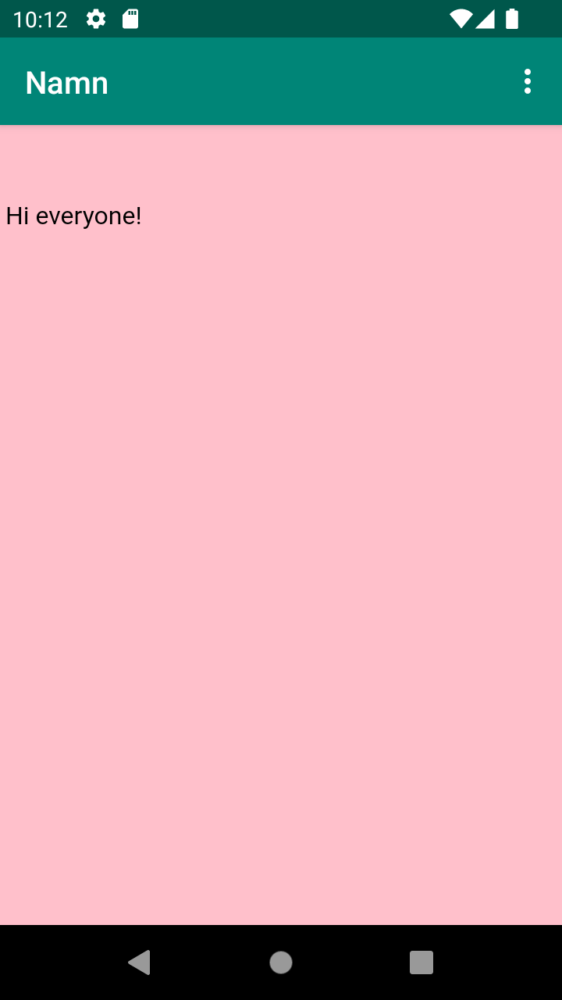

# Rapport

**Skriv din rapport här!**

Jag ändrade namnet på appen till "Namn" för att jag inte kom på något bättre.
Sedan lade jag till internet-åtkomst på filerna genom att lägga till ```<uses-permission android:name="android.permission.INTERNET"/>```.
Jag skapade en webview där en extern och intern webbsida sedan visades:
```
<WebView
        android:id="@+id/My_WebView"
        android:layout_width="401dp"
        android:layout_height="665dp"
        android:layout_marginStart="5dp"
        android:layout_marginLeft="5dp"
        android:layout_marginTop="5dp"
        android:layout_marginEnd="5dp"
        android:layout_marginRight="5dp"
        android:layout_marginBottom="5dp"
        app:layout_constraintBottom_toBottomOf="parent"
        app:layout_constraintEnd_toEndOf="parent"
        app:layout_constraintStart_toStartOf="parent"
        app:layout_constraintTop_toBottomOf="@+id/appBarLayout" />
```

Ett problem jag stötte på när jag skulle referera till min html-fil var att den verkade 
hitta filen men ingenting av det jag skrev syntes. Efter lite funderingar testade jag att lägga till
en header med lite padding och då kom texten fram. Problemet var alltså endast
att texten i html-filen hamnade under appens namn längst upp så den inte syntes.


Bilder läggs i samma mapp som markdown-filen.




Läs gärna:

- Boulos, M.N.K., Warren, J., Gong, J. & Yue, P. (2010) Web GIS in practice VIII: HTML5 and the canvas element for interactive online mapping. International journal of health geographics 9, 14. Shin, Y. &
- Wunsche, B.C. (2013) A smartphone-based golf simulation exercise game for supporting arthritis patients. 2013 28th International Conference of Image and Vision Computing New Zealand (IVCNZ), IEEE, pp. 459–464.
- Wohlin, C., Runeson, P., Höst, M., Ohlsson, M.C., Regnell, B., Wesslén, A. (2012) Experimentation in Software Engineering, Berlin, Heidelberg: Springer Berlin Heidelberg.
